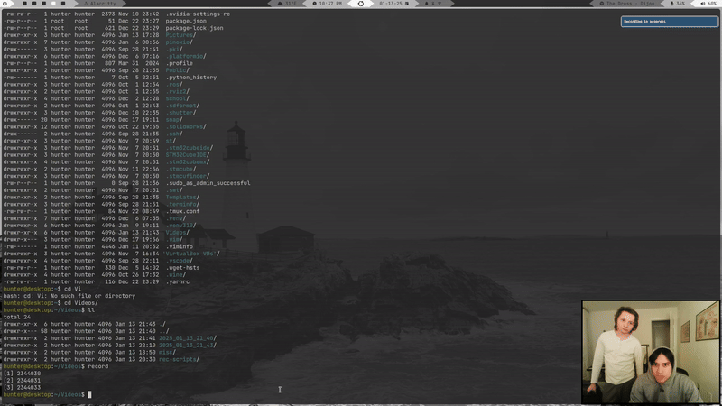

# Recording Scripts

Some simple bash scripts to record your desktop (audio and video) and overlay a camera, using ffmpeg and v4l2.


*example recording*

## Usage
To record, source and run ```rec.bash```
```
source rec.bash
record # to record
end # to end a recording
```
File are saved in ```~/Videos/"$(date '+%Y_%m_%d_%H_%M')```

To edit a video
```
cp /path/to/edit.bash /path/to/recorded/files
bash edit.bash
```
*may need to change the coordinates for camera and boarder box location*

based on [these scripts](https://github.com/BreadOnPenguins/scripts/tree/master)
